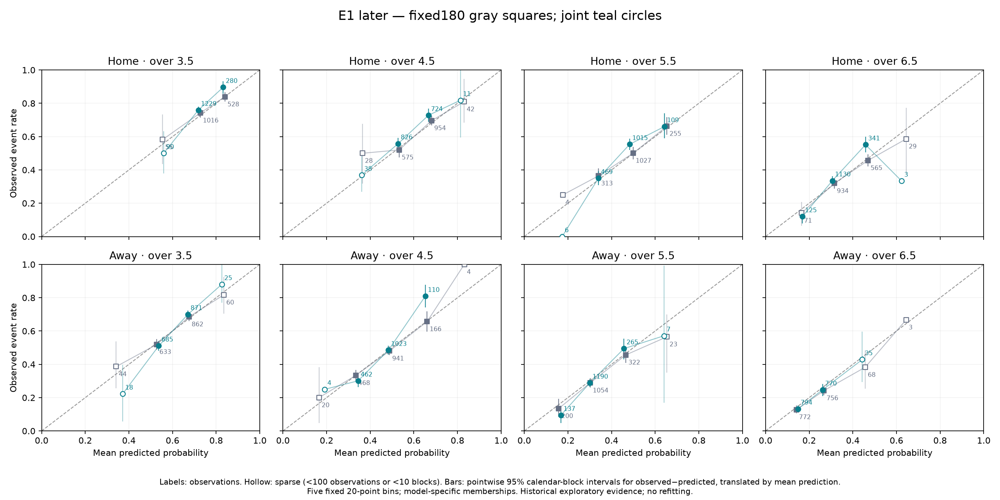
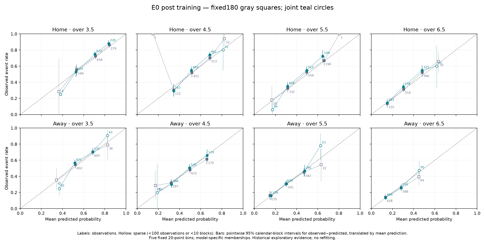
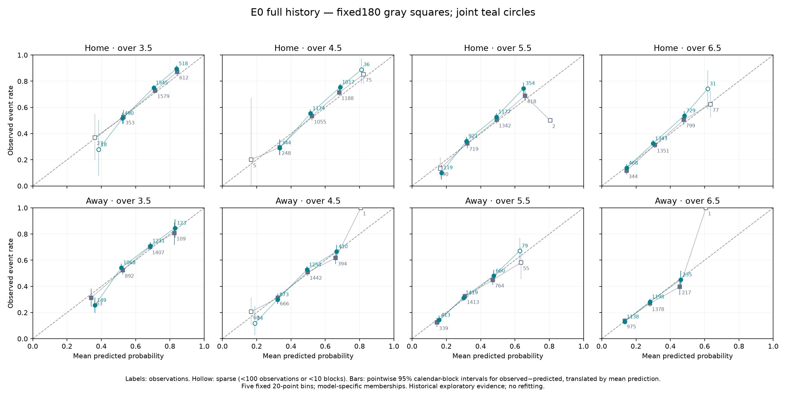

# Frozen joint corner model reliability review

The joint model ranks corner-event risk better than fixed180 on these historical cohorts, but its pooled underprediction is concentrated in home-team forecasts. Later Championship home errors are about 3.6–4.8 percentage points across all four lines; post-training EPL shows a similar, less precise pattern. Away-team calibration-in-the-large is much closer, with heterogeneous errors across probability ranges. A global upward correction is not supported. A focused home-forecast correction is a defensible future research hypothesis, not a validated change to apply now.

This independent diagnostic uses frozen predictions reproduced from DeepFC commit `7e8ad0acdcea13f5778e107882c36e5d6922fbd3`. No model fitting, changed coefficients, live collection, betting selection or publication occurred. Both models use identical fixtures. `protocol.txt` was saved before slicing; its hash and input hashes are in `manifest.json`.

## Scope and frozen reporting rules

Primary cohorts are Championship 2023/24–2025/26 (1,599 fixtures, 33 occupied 28-day blocks) and EPL 2023/24–2025/26 (1,110 fixtures, 35 blocks). The latter follows May 2023 coefficient training. Full EPL 2019/20–2025/26 (2,571 fixtures, 80 blocks) is supplementary: it overlaps the primary EPL cohort and includes retrospective applications of later-trained coefficients. None is an untouched confirmation sample.

Cuts were fixed to league/cohort, home/away and lines 3.5, 4.5, 5.5, 6.5. Bins are [0,.2), [.2,.4), [.4,.6), [.6,.8), [.8,1]. Bins with fewer than 100 observations or 10 occupied blocks are marked sparse, never merged, and do not drive conclusions. These floors are reporting rules, not power guarantees. Bins are model-specific: comparing two dots does not mean comparing identical bin membership. Overall model comparisons do use identical rows.

We resample complete nonoverlapping calendar blocks (`date ordinal // 28`) 20,000 times, seed 7, sharing draws across models, lines and venues. Means are resampled totals divided by counts. Both fixture sides stay within their original block; eight event outcomes are not eight independent fixtures. Bin draws with zero observations are undefined; intervals are omitted if more than 1% of draws are undefined. Complete bin counts, occupied blocks, observed/predicted intervals and error intervals are in the `curves` section of `results.json` (also exported as `reliability_bins.csv` when regenerated). NumPy multinomial block counts implement the same resampling law as sampling blocks with replacement, but a different random-number stream from the earlier audit.

Positive error means observed frequency exceeds predicted probability. Tables use percentage points for error intervals. Main uncertainty is pointwise 95%; an additional Bonferroni family covers the 16 joint-model line/venue cells across the two primary cohorts, with 99.6875% two-sided intervals per cell. Bin comparisons and the supplementary cohort are exploratory. The adjusted intervals have only about 31 simulation draws per tail, so fine distinctions near zero should not be overinterpreted.

## Calibration in the large

These checks average all forecasts for one venue and line. They can reveal broad offsets but cannot establish calibration within probability ranges.

### Later Championship

| Venue | Over line | Actual rate | Fixed180 predicted | Joint predicted | Joint error pp | Joint 95% error interval pp | Joint family interval pp |
|---|---:|---:|---:|---:|---:|---|---|
| home | 3.5 | 76.86% | 75.84% | 72.92% | +3.94 | [+1.96, +5.93] | [+0.86, +6.93] |
| home | 4.5 | 63.23% | 62.62% | 58.89% | +4.33 | [+2.04, +6.80] | [+0.96, +8.14] |
| home | 5.5 | 49.91% | 49.17% | 45.07% | +4.83 | [+2.22, +7.41] | [+0.79, +8.69] |
| home | 6.5 | 36.46% | 36.88% | 32.86% | +3.60 | [+1.35, +5.86] | [+0.27, +7.02] |
| away | 3.5 | 61.66% | 61.39% | 61.24% | +0.42 | [-1.30, +2.25] | [-2.20, +3.25] |
| away | 4.5 | 45.34% | 45.80% | 45.42% | -0.08 | [-2.06, +2.01] | [-3.00, +3.13] |
| away | 5.5 | 30.71% | 32.21% | 31.66% | -0.96 | [-3.05, +1.15] | [-4.11, +2.21] |
| away | 6.5 | 19.39% | 21.53% | 20.92% | -1.53 | [-3.72, +0.64] | [-4.96, +1.66] |

### Post training EPL

| Venue | Over line | Actual rate | Fixed180 predicted | Joint predicted | Joint error pp | Joint 95% error interval pp | Joint family interval pp |
|---|---:|---:|---:|---:|---:|---|---|
| home | 3.5 | 73.06% | 71.56% | 69.69% | +3.38 | [+0.60, +6.15] | [-0.65, +7.44] |
| home | 4.5 | 59.55% | 58.68% | 56.42% | +3.13 | [-0.16, +6.26] | [-1.80, +7.77] |
| home | 5.5 | 48.29% | 46.26% | 43.85% | +4.44 | [+0.91, +7.75] | [-0.97, +9.27] |
| home | 6.5 | 36.85% | 35.25% | 32.92% | +3.93 | [+0.76, +6.87] | [-1.00, +8.35] |
| away | 3.5 | 62.70% | 61.15% | 60.05% | +2.66 | [-0.01, +5.50] | [-1.13, +7.11] |
| away | 4.5 | 45.32% | 46.73% | 45.51% | -0.20 | [-2.70, +2.49] | [-3.83, +4.05] |
| away | 5.5 | 33.60% | 34.14% | 32.97% | +0.64 | [-2.60, +3.97] | [-4.20, +5.56] |
| away | 6.5 | 22.25% | 24.01% | 23.00% | -0.75 | [-3.11, +1.57] | [-4.45, +2.70] |

### Supplementary full EPL history

| Venue | Over line | Actual rate | Fixed180 predicted | Joint predicted | Joint error pp | Joint 95% error interval pp | Joint family interval pp |
|---|---:|---:|---:|---:|---:|---|---|
| home | 3.5 | 73.12% | 71.55% | 69.55% | +3.57 | [+1.84, +5.30] | — |
| home | 4.5 | 60.25% | 58.59% | 56.22% | +4.02 | [+2.07, +5.96] | — |
| home | 5.5 | 47.14% | 46.08% | 43.62% | +3.52 | [+1.42, +5.59] | — |
| home | 6.5 | 35.51% | 34.99% | 32.67% | +2.84 | [+1.05, +4.62] | — |
| away | 3.5 | 62.04% | 61.30% | 60.36% | +1.68 | [-0.34, +3.68] | — |
| away | 4.5 | 46.64% | 46.82% | 45.81% | +0.83 | [-1.02, +2.69] | — |
| away | 5.5 | 33.99% | 34.17% | 33.22% | +0.77 | [-1.22, +2.71] | — |
| away | 6.5 | 22.99% | 23.99% | 23.21% | -0.22 | [-1.74, +1.30] | — |

All four Championship home errors exclude zero under the declared 16-cell adjustment at 28-day blocking. Pointwise home intervals remain above zero at both 14 and 56 days. This supports a systematic historical home offset under the resampling assumptions, not a prospective claim. Baseline home point errors are smaller, between −0.42 and +1.03 pp, though those estimates also have uncertainty.

Post-training EPL home errors are +3.13 to +4.44 pp. Three of four pointwise home intervals exclude zero at 14, 28 and 56 days; over 4.5 does not. None excludes zero under the main 16-cell adjustment. This is directional corroboration with limited precision, not independent statistical confirmation. EPL away over 3.5 is +2.66 pp, and its pointwise zero-exclusion changes with block length: treat it as uncertain. The other EPL away pooled errors lie between −0.75 and +0.64 pp. All primary away family intervals include zero; that does not demonstrate equivalence or perfect calibration.

## Where the errors occur

Home underprediction spans several lines and commonly populated probability ranges, rather than one isolated threshold. Some representative supported bins illustrate the scale; every prespecified bin is shown in the plots and complete JSON tables, so these examples are not a selected decision rule.

| Cohort and cell | Probability bin | Count | Mean prediction | Event frequency | Observed minus predicted 95% interval pp |
|---|---|---:|---:|---:|---|
| E1_later, home, over 3.5 | 0.6-0.8 | 1229 | 71.82% | 75.92% | [+1.94, +6.17] |
| E1_later, home, over 5.5 | 0.4-0.6 | 1015 | 48.30% | 55.37% | [+3.73, +10.36] |
| E1_later, home, over 6.5 | 0.4-0.6 | 341 | 45.81% | 55.13% | [+4.69, +14.23] |
| E1_later, home, over 6.5 | 0.0-0.2 | 125 | 16.91% | 12.00% | [-9.13, -1.05] |
| E1_later, away, over 4.5 | 0.2-0.4 | 462 | 34.42% | 30.09% | [-7.99, -0.48] |
| E1_later, away, over 4.5 | 0.6-0.8 | 110 | 65.23% | 80.91% | [+8.93, +22.45] |
| E0_post_training, home, over 3.5 | 0.6-0.8 | 672 | 70.69% | 74.85% | [+0.52, +7.76] |
| E0_post_training, home, over 4.5 | 0.6-0.8 | 461 | 68.44% | 73.97% | [+1.64, +9.55] |
| E0_post_training, home, over 5.5 | 0.4-0.6 | 511 | 49.54% | 54.79% | [+0.29, +9.92] |
| E0_post_training, home, over 6.5 | 0.4-0.6 | 321 | 48.06% | 54.83% | [+0.76, +12.93] |

The exceptions matter. Championship home over 6.5 at predicted probabilities below 20% is overpredicted, while its 40–60% bin is underpredicted. Championship away over 4.5 has opposite errors in lower and higher probability bins despite near-zero pooled error. The higher bin has 110 observations, just above the reporting threshold: its conspicuous gap is exploratory and vulnerable to multiplicity and sampling variation. There is no reason to treat it as a betting opportunity or a stable correction target by itself. A venue-wide offset may still fail to repair range-dependent errors.

Hollow sparse points can look extreme, especially when one or a handful of outcomes dominate. Their empirical bootstrap may even be degenerate because resampling cannot invent unseen outcomes. Do not interpret narrow or zero-width intervals in such cells as precision. Across both models and all cohorts, 106 of 240 bins are empty or sparse. No inference is drawn from those visual excursions.

## Reliability and discrimination

We report AUC as a descriptive rank-separation statistic with half credit for ties. No new model or calibration function is fitted. The joint AUC exceeds fixed180 in all 16 primary venue/line cells, although one improvement is tiny and we do not claim all differences are statistically established. Brier improves in 15 of those 16 cells; the exception is post-training EPL home over 3.5 (+0.00013).

For fixed bins we compute the exact identity:

`Brier = uncertainty − binned resolution + binned reliability + within-bin remainder`.

Reliability is the count-weighted squared difference between bin mean prediction and event rate; lower is better. Resolution is the weighted squared difference between bin event rate and overall event rate; higher is better. The remainder is weighted within-bin forecast variance minus twice within-bin covariance of prediction and outcome. Omitting it would incorrectly apply the binned-forecast decomposition to continuous probabilities. The coarsened Brier score instead equals uncertainty − resolution + reliability.

The table averages the eight venue/line decompositions per cohort with equal weights, matching the score objective. AUC is averaged descriptively, not pooled into a new discrimination test.

| Cohort | Model | Brier | Binned reliability | Binned resolution | Within-bin remainder | Mean AUC |
|---|---|---:|---:|---:|---:|---:|
| E1_later | fixed180 | 0.209179 | 0.000276 | 0.007613 | -0.001648 | 0.622647 |
| E1_later | joint | 0.206365 | 0.001858 | 0.010251 | -0.003405 | 0.649809 |
| E0_post_training | fixed180 | 0.210068 | 0.000634 | 0.012810 | -0.002491 | 0.652535 |
| E0_post_training | joint | 0.206135 | 0.001530 | 0.016628 | -0.003503 | 0.674207 |

On both primary cohorts, joint binned reliability is worse on average while resolution and rank separation improve. Within-bin behavior also contributes to the Brier gain. Thus a better overall proper score coexists with less accurate absolute probability levels; “better Brier” is not synonymous with “better calibrated.” Coarse-bin terms depend on the chosen bins and have finite-sample noise: the squared empirical calibration term is not an unbiased population miscalibration estimate. No significance claim or causal attribution is made from these component differences.

## Interpretation and next decision

One focused future calibration research question is justified: can a restrained correction of the joint model’s home-team probability levels improve reliability while retaining its discrimination and coherent ordering across lines? These findings do not justify selecting its form, magnitude or fitted parameters, or changing current forecasts. A blanket uplift across both venues is particularly unsupported because away averages are close and some low-probability cells already overpredict. Even a single home offset could worsen the low-probability exceptions.

If a correction is pursued, choose one form and an estimation procedure on designated development data, preserve coherent line probabilities, then freeze it before genuinely new confirmation outcomes. Do not use this same historical diagnostic as its validation. There is no need to launch another feature search or tune bins, venues, leagues or thresholds to find a favorable correction. The existing frozen joint model remains a promising research candidate with an identified calibration limitation.

Missing confirmation evidence remains: forecasts archived before outcomes, timestamped and source-matched odds at the declared horizon, a realistically powered prospective cohort, and approved practical margins. All these histories were reused; EPL full and post-training cohorts overlap, and shared leagues or repeated architecture inspection prevent an independence claim. Block resampling does not remove selection bias, authenticate quote timing, or protect against arbitrary cross-block team dependence and regime changes. No corner-price strategy, execution cost or betting-profit claim is evaluated.

## Reproduction and validation

Run `OPENBLAS_NUM_THREADS=1 MPLCONFIGDIR=/tmp/deepfc-mpl python diagnostic.py`, then `python write_report.py` in an environment with the versions in `manifest.json`. The bundled NPZ files contain the independently reconstructed outcomes, frozen means, dispersion, dates, venues and season labels. They originate from the audit’s 18 hash-verified source files; `../audit/source_manifest.json` records those hashes. The full audit reconstruction script is retained at ../audit/reproduce.py.

The script asserts complete home/away pairing, uses unchanged means and dispersion to reconstruct coherent NB probabilities, and checks the decomposition identity to numerical precision. The two primary overall Brier scores reproduce the prior audit. Hash checks before and after confirm the frozen NPZ inputs are unchanged. Plots were visually inspected. No tracked repository source or result artifact was edited. These historical diagnostic artifacts are published separately without changing the original model or conclusions.
